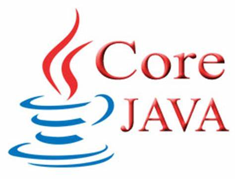
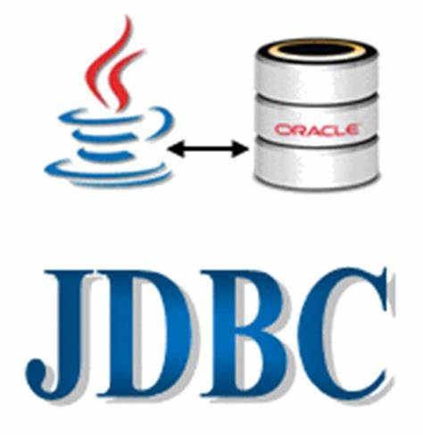
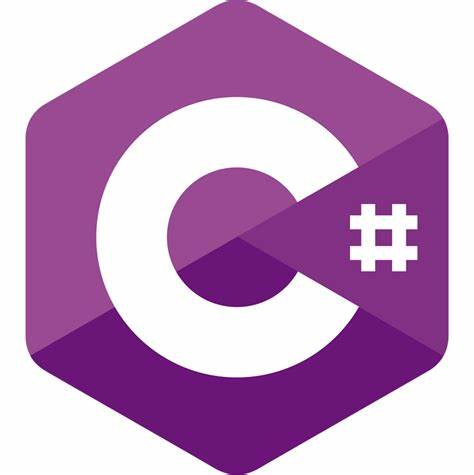
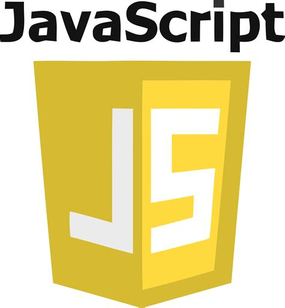
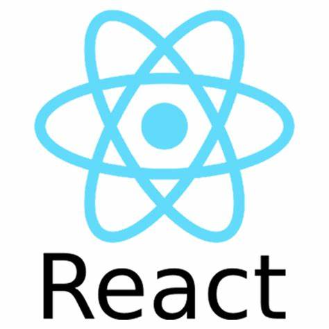

permalink: /404.html

<!DOCTYPE html>
<html lang="en">
<head>
    <meta charset="UTF-8">
    <meta http-equiv="X-UA-Compatible" content="IE=edge">
    <meta name="viewport" content="width=device-width, initial-scale=1.0">
    <title>Rujuta Jagtap</title>
    <link rel="stylesheet" href="style.css">
</head>
<body>
    

        

            <nav>
                <ul>
                    <li><a href="/">Home</a></li>
                    <li><a href="/intro.html">About Me</a></li>
                    <li><a href="/services.html">Services</a></li>
                    <li><a href="/blog.html">Blogs</a></li>
                    <li><a href="/contact.html">Contact Me</a></li>
                </ul>
            </nav>
        

        

            

                
                
            

            

               <h2>About Me</h2> 
               <ul> <li>My name is Rujuta Dashrath Jagtap I recently did PG-DAC(Post-Graduation Diploma In Advanced Computing) in Nov 2022.</li>
                <li>I completed Bacholors Of Engineering in Civil from Savitribai Phule Pune University.</li> 
                        <li>In PG-DAC I learned numbers of modules such as</li></ul>
        <ol> 
        <li>Core java(OOps, Multithreading ,Exception handling, String, Arrays, Collection ,jdk, jre ,jvm .etc.),</li>
         <li>Web technologies(html, CSS, JavaScript,React.js)</li>
         <li>Database Management System(MySQL, SQL)</li>
         <li>Advanced Java(JDBC, Springboot)</li>
         <li>Microsoft .NET Frame work(.NET, C#)</li>
         <li>Data Structure and Algorithm with java</li>
         <li>Operating System(Linux)</li>
         <li>Software Development (GitHub,JIRA)</li>
         </ol>
              <h3>Project 1:</h3>
             
By using these module I did two Projects first one  which name is Industry Document Management System for this Technology used for frontend React.js for Backend Springboot, for database MySQL and for testing Postman software used. Purpose of project is to give online platform for user to store and easily access company documentations and records based on their role and Authorization.

             <h3>Project 2:</h3> 
             
My Second Project name is My Portfolio which is a personal portfolio, portfolio is a compilation of work samples and professional documentation that provides proof of your accomplishments or samples of your work.This is a Responsive Website i.e it easily readable and accessible to user in computer screen as well as mobile,ipad screen. In this project user can access my information such as my carrier details,services, achievements, contact details, CV etc.Technology used for structure of website HTML,CSS used to format the layout of a webpage JavaScript for to enhance functionality and logic of webpages.

        <h2>My Skills</h2>
        

     
            
Excellent       :

            
Good      :

            
Avrage     :

 

       
            
HTML       :

            
CSS        :

            
React      :

            
Core Java  :

            
SpringBoot :

            
MySQl      :

            
JDBC       :

            
.NET       :

        

        

            
            
            
            
            
            
            
            
            
            
        

        

        

    

    <!-- 
 -->
  <!-- ToDo:Create gallary for my Project -->
  

</body>
</html>
